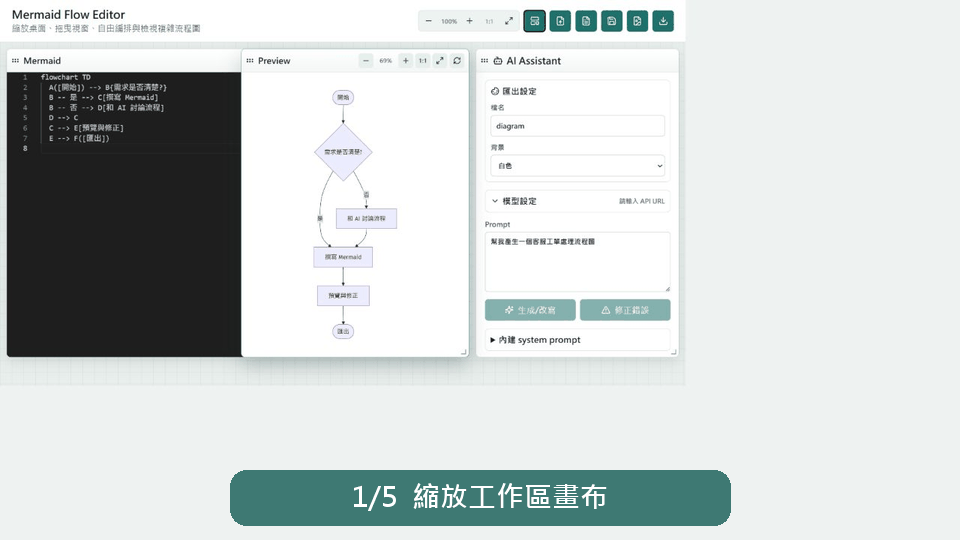
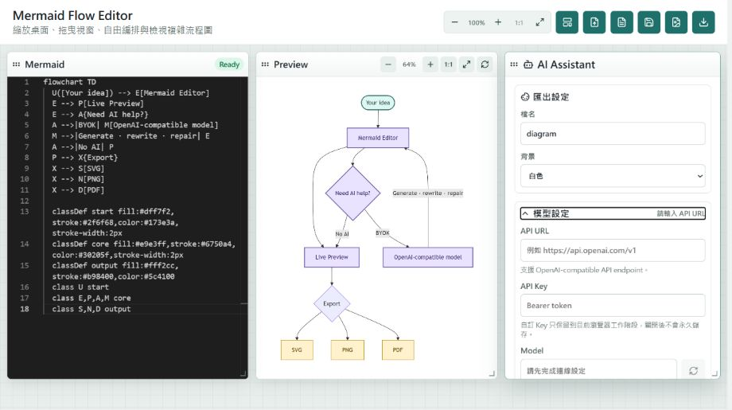

# Mermaid Flow Editor

[English version](README.en.md) · **繁體中文**

> 目前應用程式介面預設為中文，多語言切換功能將於未來版本支援。

一個可自行部署的 Mermaid 工作區，提供即時預覽、匯出工具，以及支援
OpenAI 相容 API 的 BYOK AI 助手。

[](LICENSE)
[](package.json)
[](https://github.com/PIGGYcloudy/mermaid-flow-editor/actions/workflows/ci.yml)

> 本專案由 [OpenAI Codex](https://openai.com/codex/) 協作製作並完成開源。
> 這是獨立的社群專案，並非 OpenAI 官方產品。

> **僅支援 BYOK：**本專案沒有帳號系統，也不會在伺服器端儲存 AI 憑證。
> 使用者提供的 API 金鑰只會保存在瀏覽器的 `sessionStorage`，並且只會在該
> 使用者發出 AI 請求時，經由應用程式 proxy 傳送。



## 主要功能

- 使用 Monaco 的 Mermaid 編輯器，支援即時渲染與易讀的語法錯誤訊息
- 使用任一 OpenAI 相容 API 生成、改寫與修復 Mermaid 圖表
- 從供應商的 `/models` 端點載入模型清單並測試連線
- 可移動及調整大小的 Editor、Preview 與 AI Assistant 視窗
- 工作區與圖表各自擁有獨立的平移與縮放控制
- 匯入 `.mmd`、`.mermaid` 與 `.txt`
- 匯出 Mermaid、SVG、PNG 與 PDF
- Mermaid 嚴格安全模式
- Docker 映像檔與 `/healthz` 健康檢查端點

不設定 AI 也能使用編輯、預覽與匯出功能。

## 使用 Docker 部署

Docker 是本專案支援的正式環境部署方式。Linux 使用 Docker Engine，Windows
使用 Docker Desktop；Windows 請切換至 Linux 容器模式。兩個平台使用
相同的 Docker Compose 工作流程。

Linux：

```bash
cp .env.example .env
docker compose up -d --build
```

Windows PowerShell：

```powershell
Copy-Item .env.example .env
docker compose up -d --build
```

部署完成後開啟 `http://localhost:3000`。使用下列指令確認部署狀態與查看記錄：

```bash
docker compose ps
docker compose logs -f app
```

使用下列指令停止並移除應用程式容器：

```bash
docker compose down
```

帶有版本 tag 的發布版本與手動發布工作流程也會提供預先建置的映像檔：

```text
ghcr.io/piggycloudy/mermaid-flow-editor-byok
```

容器提供 `/healthz` 端點，並使用 Compose 健康檢查與
`unless-stopped` 重新啟動策略。目前不提供原生 Node.js 背景服務的部署文件，
也不支援以此方式部署；正式環境請使用 Docker。

## 本機開發

本機開發需要 Node.js 22.12 或更新版本。以下雙程序工作流程僅供開發使用，
不是正式環境部署方式。

Linux 或 macOS：

```bash
npm ci
cp .env.example .env
npm run server
```

Windows PowerShell：

```powershell
npm ci
Copy-Item .env.example .env
npm run server
```

在第二個終端機執行：

```bash
npm run dev
```

開啟 `http://localhost:5173`。CI 會在 Linux 與 Windows 驗證套件安裝、伺服器
測試及正式版本建置。若要使用 AI，請輸入：

- **API URL：**OpenAI 相容 API 的基礎 URL，例如
  `https://api.openai.com/v1`
- **API Key：**供應商提供的權杖
- **Model：**從發現的模型清單選擇，或直接輸入模型 ID

API URL 與模型會儲存在瀏覽器的 localStorage。API 金鑰只會保存在
`sessionStorage`，關閉分頁後即清除。應用程式不會把金鑰寫入資料庫或磁碟。

### BYOK 模型設定

展開 **模型設定** 即可連接 OpenAI 相容 API 的端點。AI 並非必要功能；
沒有設定 API URL 或金鑰時，仍可正常編輯、預覽及匯出圖表。



## 對外公開部署

本專案沒有內建驗證或存取控制。需要限制存取時，請在反向代理伺服器、VPN 或
託管平台加入驗證，並使用 HTTPS。

為方便本機與私人環境使用，代理伺服器預設接受任何 HTTP(S) API 主機。若服務會對
網際網路公開，強烈建議設定允許清單，以降低 SSRF 風險：

```dotenv
AI_API_ALLOWED_HOSTS=api.openai.com,openrouter.ai
```

設定後只接受清單內的 `host[:port]` 值，且不會跟隨上游重新導向。這是部署者
的控制項，不是一般本機使用的必要設定。更多注意事項請見
[SECURITY.md](SECURITY.md)。

## 設定

| 環境變數 | 用途 | 預設值 |
| --- | --- | --- |
| `APP_API_PORT` / `PORT` | 開發／正式環境伺服器連接埠 | `3001` / `3000` |
| `AI_API_ALLOWED_HOSTS` | 可選的 `host[:port]` 代理伺服器允許清單 | 不限制 |
| `MODELS_TIMEOUT_MS` | 模型清單請求逾時時間 | `15000` |
| `CHAT_TIMEOUT_MS` | AI 聊天請求逾時時間 | `120000` |
| `JSON_BODY_LIMIT` | JSON 請求本文大小上限 | `256kb` |

## 驗證

```bash
npm test
npm run build
npm run test:browser
```

## 架構

Vite/React 用戶端負責編輯與渲染 Mermaid 圖表。小型 Express 代理伺服器會驗證
BYOK 請求、正規化 OpenAI 相容 URL、轉送 `/models` 與
`/chat/completions`，並套用可選的主機允許清單。伺服器沒有使用者資料庫，
也沒有內建或共用的 AI 憑證。

## 參與貢獻

歡迎提出 issue 與範圍明確的 pull request。請先閱讀
[CONTRIBUTING.md](CONTRIBUTING.md)；安全問題請依照
[SECURITY.md](SECURITY.md) 使用私密管道回報。

## 授權

採用 [MIT License](LICENSE)。Mermaid Flow Editor 是獨立專案，與 Mermaid
Chart、OpenAI 或任何 AI 供應商均無從屬關係。
